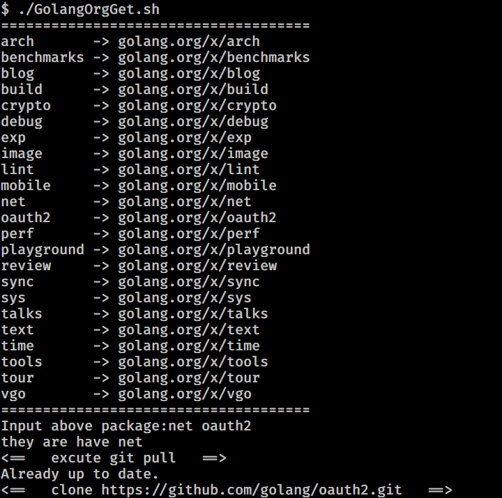
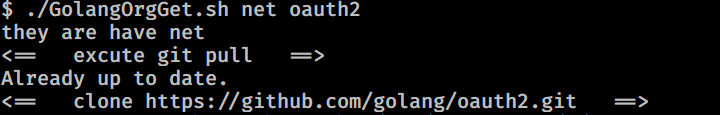

# GolangOrgGet
从 github.com/golang 获取 golang.org/x 包的镜像，到 `$GOPATH/src/golang.org/x` 

同时也可以更新 golang.org/x 的包

## Update

golang 1.11版本推出go mod的同时，还推出了一个新的环境变量GOPROXY，它的作用类似http(s)_proxy，用于为golang代码仓库做镜像代理。

设置环境变量即可 go get golang.org/x 包。

例如

`export GOPROXY=https://gocenter.io`

## How to Use

你可以一次输入多个包名进行下载

也可以把多个包名当成参数输入

